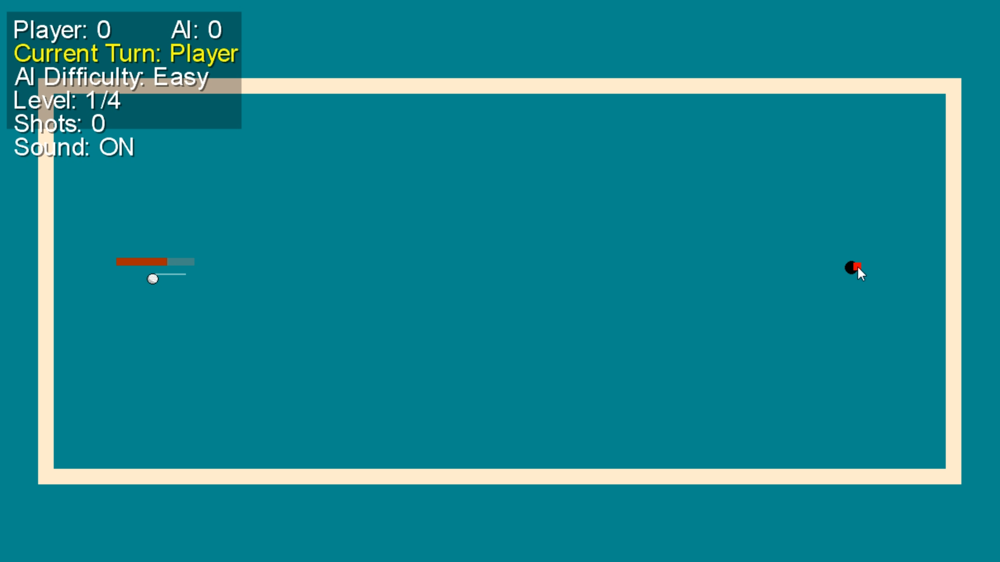
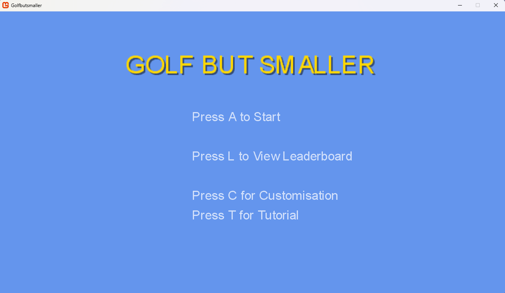
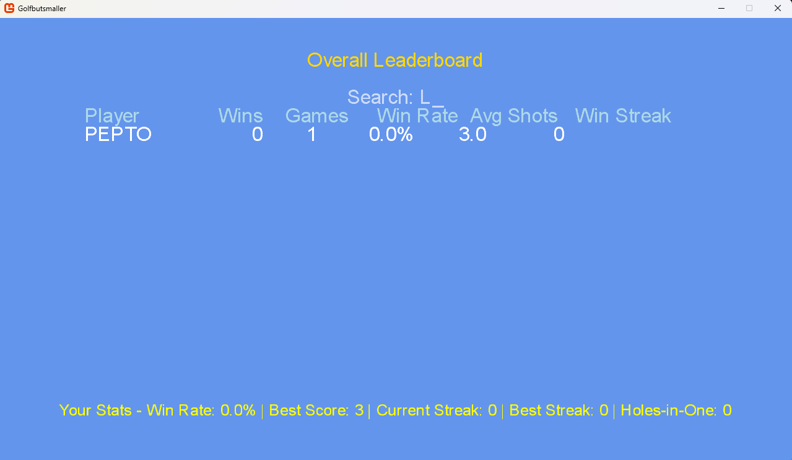
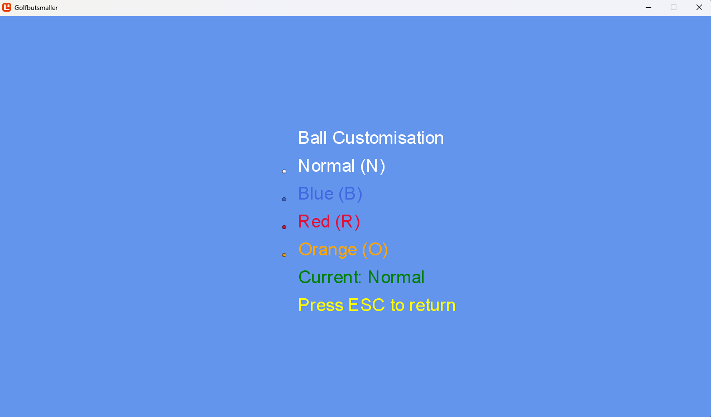
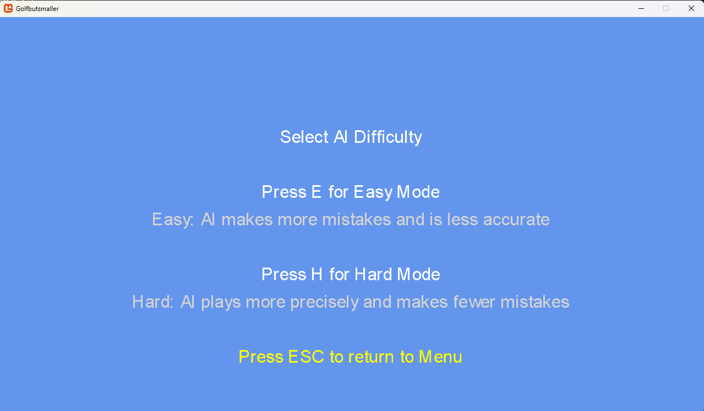
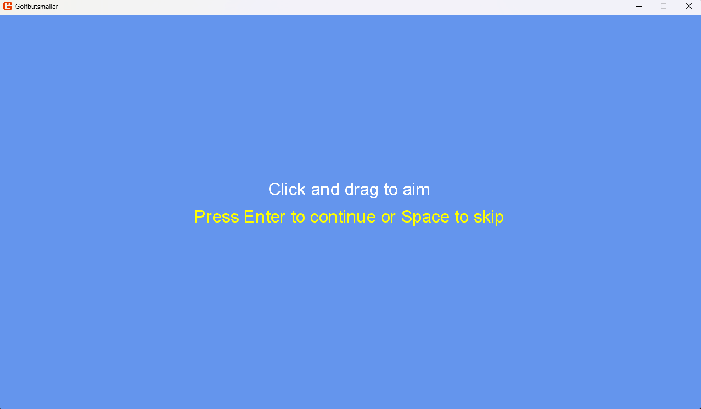

# Golfbutsmaller

A desktop golf game developed in **C#** using **Windows Forms** as part of my A-Level Computer Science NEA.

This project challenged me to design and develop a complete desktop game from scratch, demonstrating object-oriented programming, AI behaviour, user interface design, game state management and persistent player statistics.

---

## Gameplay Demo

A short gameplay demonstration is included in this repository.

📹 **GolfbutsmallerDemo.mp4**

---

# Screenshots

## Gameplay

Real-time gameplay showcasing the aiming system, power meter, AI opponent and in-game HUD.



## Main Menu

The main navigation screen providing access to all game features.



## Leaderboard

Persistent player statistics including wins, games played, win percentage and best score.



## Ball Customisation

Players can personalise the appearance of their golf ball before starting a game.



## AI Difficulty Selection

Choose between different AI difficulty levels before starting a match.



## Tutorial

Built-in tutorial explaining gameplay mechanics and controls for new players.



---

# Features

- AI-controlled opponent
- Adjustable AI difficulty
- Multiple playable levels
- Ball customisation
- Persistent leaderboard
- Player statistics
- Win tracking
- Shot tracking
- Interactive tutorial
- Coin flip to determine turn order
- Pause functionality
- Multiple game screens
- Save/load player statistics

---

# Technologies

- C#
- Windows Forms
- Visual Studio
- .NET Framework
- Object-Oriented Programming (OOP)

---

# Running the Project

1. Clone or download this repository.
2. Open `Golfbutsmaller.sln` in Microsoft Visual Studio.
3. Build the solution.
4. Run the project.

---

# Repository Structure

```text
Golfbutsmaller/
│
├── Content/
│   ├── Fonts/
│   ├── Images/
│   └── Levels/
│
├── Screenshots/
│
├── GolfbutsmallerDemo.mp4
├── Golfbutsmaller.sln
├── Golfbutsmaller.csproj
├── README.md
│
└── Source Files
    ├── AIPlayer.cs
    ├── GameplayScreen.cs
    ├── LeaderboardManager.cs
    ├── PlayerStats.cs
    ├── TutorialScreen.cs
    └── ...
```

---

# Skills Demonstrated

- Object-Oriented Programming
- Game Development
- Artificial Intelligence
- User Interface Design
- State Management
- File Handling
- Data Persistence
- Collections & Data Structures
- Software Architecture
- Debugging & Testing

---

# Future Improvements

Potential future improvements include:

- Additional golf courses
- Smarter AI behaviour
- Improved graphics and animations
- Additional sound effects and music
- Multiplayer support
- Achievement system
- Expanded player customisation

---

## Author

**Khuma Sharneck**

Computer Science Student at the University of Reading

Aspiring Software Engineer

GitHub: https://github.com/KhumaSharneck

LinkedIn: https://www.linkedin.com/in/khuma-sharneck-a47a3a2b1
