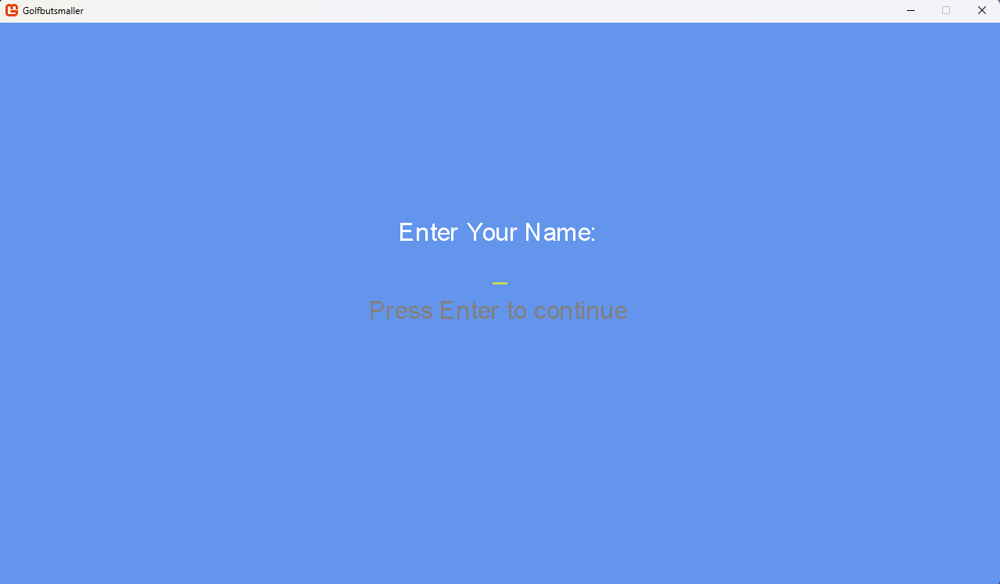
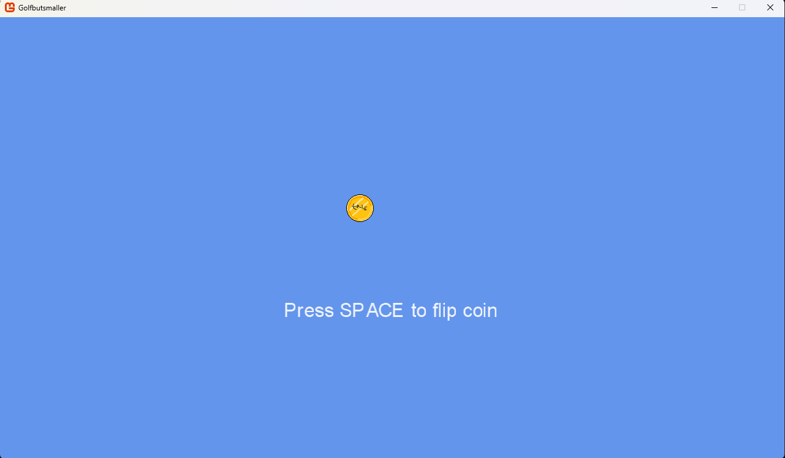
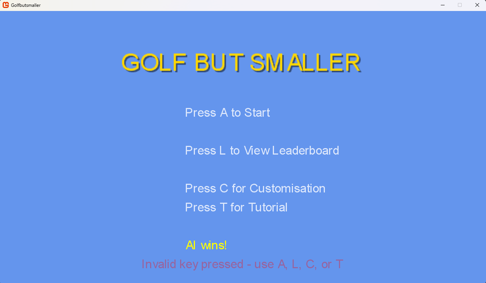

# Golfbutsmaller

A desktop golf game developed in **C#** using **Windows Forms** as part of my A-Level Computer Science NEA.

The project demonstrates object-oriented programming, AI behaviour, user interface design, persistent player statistics and game state management.

---

## Gameplay Demo

A short demonstration of the project can be found in:

**GolfbutsmallerDemo.mp4**

---

# Screenshots

## Main Menu


---

## Gameplay


Real-time gameplay showing aiming mechanics, power meter, AI opponent and in-game HUD.

---

## Name Entry



---

## Tutorial


---

## AI Difficulty Selection


---

## Ball Customisation


---

## Coin Flip



---

## Leaderboard


---

## Match Result



---

# Features

- AI-controlled opponent
- Adjustable AI difficulty
- Multiple playable levels
- Ball customisation
- Persistent leaderboard
- Player statistics
- Win tracking
- Shot tracking
- Interactive tutorial
- Coin flip to determine turn order
- Pause functionality
- Multiple game screens
- Save/load player statistics

---

# Technologies

- C#
- Windows Forms
- Object-Oriented Programming (OOP)
- Visual Studio
- .NET Framework

---

# Project Structure

```
Golfbutsmaller
├── Content
│   ├── Fonts
│   ├── Images
│   └── Levels
├── GameplayScreenshots
├── AIPlayer.cs
├── Game1.cs
├── GameplayScreen.cs
├── LeaderboardManager.cs
├── PlayerStats.cs
├── TutorialScreen.cs
├── Golfbutsmaller.csproj
└── README.md
```

---

# Skills Demonstrated

- Object-Oriented Programming
- Artificial Intelligence
- Game Development
- UI Design
- File Handling
- Data Persistence
- Collections & Data Structures
- State Management
- Software Architecture
- Debugging & Testing

---

# Future Improvements

Potential future improvements include:

- Additional golf courses
- Improved AI decision making
- Better graphics and animations
- Sound effects and music
- Multiplayer support
- Achievement system
- Expanded player customisation

---

## Author

**Khuma Sharneck**

Computer Science student at the University of Reading

Aspiring Software Engineer
